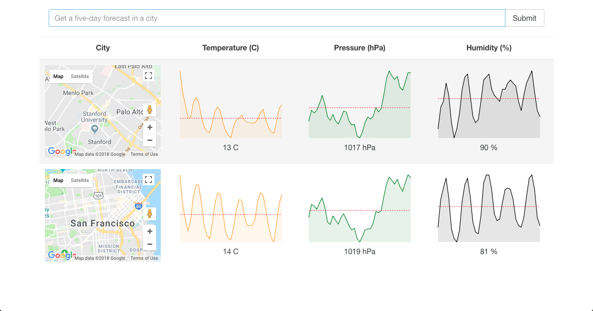

# Simple React Weather App

<p>
    
<p>

## Setup

You will need to setup an account on OpenWeatherMap and generate an API key that will be inserted in `src/actions/index.js file`.

```
npm install
npm start
```

Navigate to `http://localhost:8080/webpack-dev-server/` once npm has successully started application.

## Description

This app makes use of the <a href="https://openweathermap.org/api">OpenWeatherMap API to retrieve weather data</a>.
<a href="http://borisyankov.github.io/react-sparklines/">React Sparklines is used to generate graphs.

## Usage

Input a city and see the average temperature, pressure and humidity.
